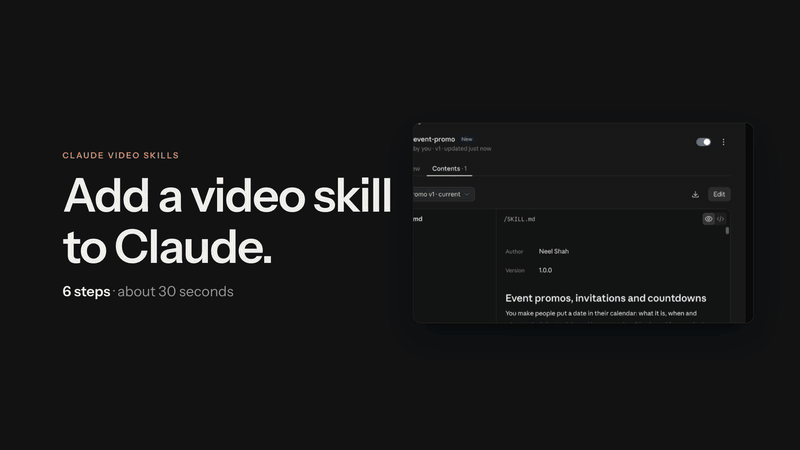
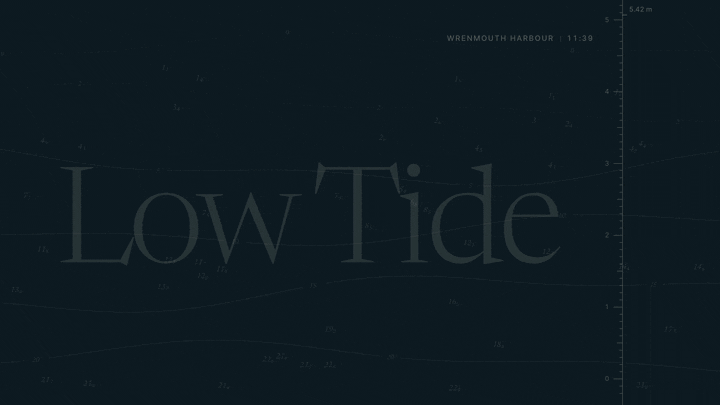
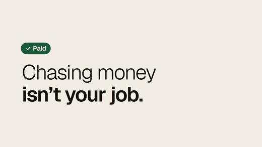
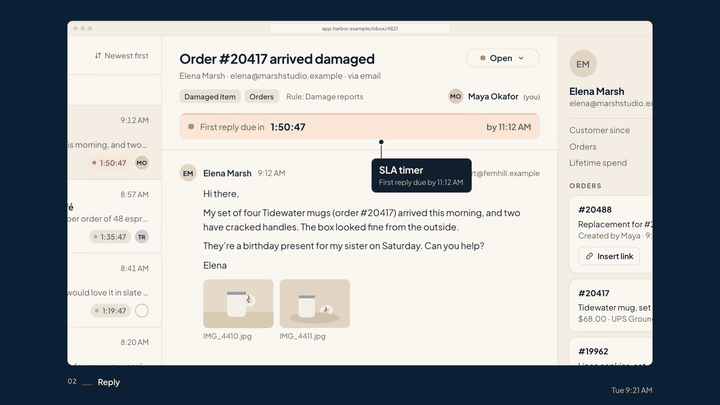
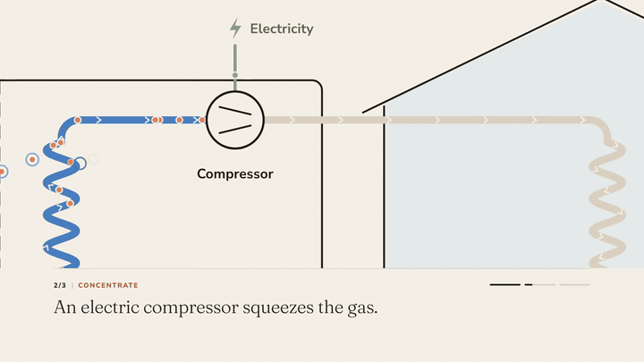
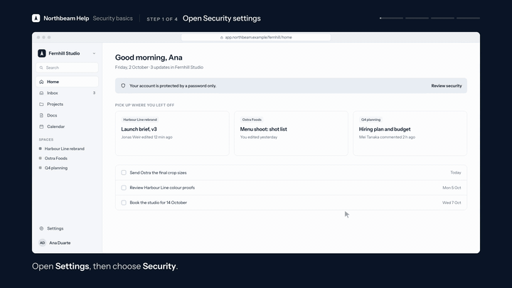
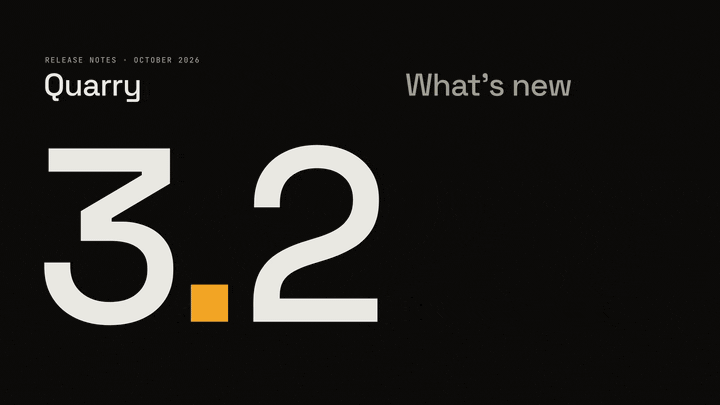
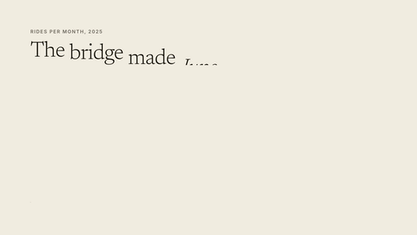
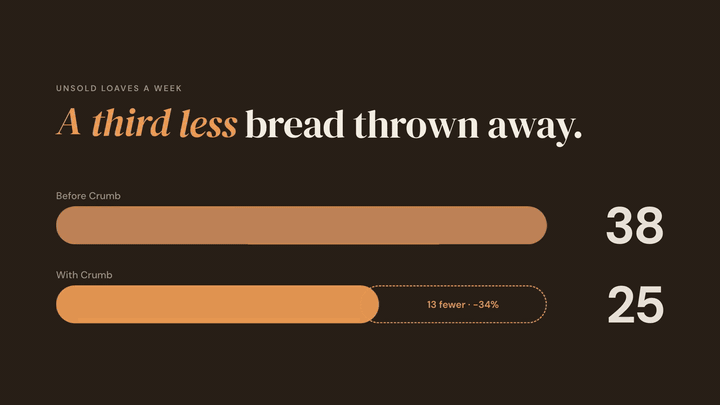
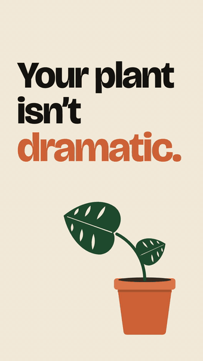

<div align="center">


# Claude Video Skills

### Make professional motion-graphics videos with Claude: launch films, explainers, product walkthroughs, social ads, data stories and more.

**One prompt in, a polished film out: one HTML file and an MP4.**

[](https://claude.ai)
[](https://code.claude.com/docs/en/skills)
[](https://www.anthropic.com/claude)
[](#the-11-skills)
[](#what-every-film-includes)
[](LICENSE)

🌐 **[Website](https://neelshah1810.github.io/Claude-Video-Skills/)** · [How to use](#how-to-use) · [Gallery](#gallery) · [The 11 skills](#the-11-skills) · [Creative controls](#creative-controls) · [FAQ](#faq)

⭐ **If you like this, please star the repo.** It helps other people find it.

</div>

---

**Claude Video Skills** is a free, open-source set of 11 [Claude skills](https://support.claude.com/en/articles/12512180-use-skills-in-claude) that turn Claude into a video studio. Ask in plain words, and Claude makes a finished motion-graphics video: kinetic typography, animated product UI, charts, transitions and its own music score, cut on the beat. You get a self-contained **HTML film** and a ready-to-share **MP4**. There's no video editor and no timeline to learn.

Claude works the way a senior in-house creative team would: creative director, motion designer, film editor, typographer and sound designer in one.
- **Before it builds,** it writes a brief, a concept, storyboards and a beat sheet.
- **After it builds,** it checks every frame and the audio, and scores the film in a director's review.

That review is how the films avoid looking AI-generated.

## How to use

The skills work in the **Claude app** (claude.ai on the web and the desktop app) and in **Claude Code**. Pick any of the 11 skills; each one is a single `SKILL.md` file.

### In the Claude app

<div align="center">

[](how-to-use/claude-app.mp4)

[▶ Watch the full-quality video (MP4)](how-to-use/claude-app.mp4)

</div>

1. **Download a skill.** In this repo, open any skill folder (for example `event-promo/`), open its `SKILL.md`, then click **•••** › **Download**.
2. **Open your skills.** In Claude, click **+** in the chat box › **Skills** › **Manage skills**.
3. **Upload it.** Click **Add** › **Upload skill**, drop the `SKILL.md` in, and click **Upload**. Check that the preview shows the skill's **name and description**, then upload. The skill appears in your list, switched on. A `.zip` of the whole skill folder works too.
4. **Use it.** In any chat, type `/` and the skill's name, then what you want:

   ```text
   /event-promo 20-second promo for our Design Systems Meetup:
   Thu 12 Nov, 7 pm, Lisbon. Free tickets at meetup.example
   --motion:high
   ```

   You can also just describe the video in plain words; Claude picks the matching skill up by itself.

Skills need code execution: **Settings › Capabilities › Code execution and file creation** must be on. Custom skills are available on Claude's Free, Pro, Max, Team and Enterprise plans ([Anthropic's guide](https://support.claude.com/en/articles/12512180-use-skills-in-claude)).

### In Claude Code

Copy a skill into your skills folder:

```bash
git clone https://github.com/Neelshah1810/Claude-Video-Skills
mkdir -p ~/.claude/skills
cp -R Claude-Video-Skills/event-promo ~/.claude/skills/
```

To install all 11 at once:

```bash
for d in Claude-Video-Skills/*/; do [ -f "$d/SKILL.md" ] && cp -R "$d" ~/.claude/skills/; done
```

- **Where skills live:** `~/.claude/skills/` makes a skill available in every project. To use it in one project only, put it in that project's `.claude/skills/` instead.
- **One file is enough:** copying just `SKILL.md` into `~/.claude/skills/event-promo/` works too.
- **Use it:** start `claude`, then type `/event-promo` followed by your request, or just ask in plain words. `/skills` lists everything installed.

### Claude Agent SDK and API

Place the skill folder in your agent's skills directory.

## Gallery

Every film below was made by Claude with one of these skills, following that skill's own instructions. The loops are 6-second previews; click one, or the link under it, to watch the full film. All brands, people and numbers in them are fictional.

<div align="center">

<a href="motion-film/SKILL.md"></a>

### Low Tide
A documentary title sequence · cinematic, type-led · 26 s

<a href="motion-film/examples/low-tide-titles.mp4"></a>

[▶ Watch the full film (MP4)](motion-film/examples/low-tide-titles.mp4) · [Open the HTML](motion-film/examples/low-tide-titles.html) · [Get the `motion-film` skill](motion-film/SKILL.md)

</div>

<br>

<div align="center">

<a href="launch-film/SKILL.md"></a>

### Tally
Invoices that chase themselves · clean, concept-led · 30 s

<a href="launch-film/examples/tally-launch.mp4"></a>

[▶ Watch the full film (MP4)](launch-film/examples/tally-launch.mp4) · [Open the HTML](launch-film/examples/tally-launch.html) · [Get the `launch-film` skill](launch-film/SKILL.md)

</div>

<br>

<div align="center">

<a href="product-walkthrough/SKILL.md"></a>

### Harbor
One support ticket, from arrival to resolved · calm product tour · 30 s

<a href="product-walkthrough/examples/harbor-walkthrough.mp4"></a>

[▶ Watch the full film (MP4)](product-walkthrough/examples/harbor-walkthrough.mp4) · [Open the HTML](product-walkthrough/examples/harbor-walkthrough.html) · [Get the `product-walkthrough` skill](product-walkthrough/SKILL.md)

</div>

<br>

<div align="center">

<a href="explainer-video/SKILL.md"></a>

### How a heat pump heats your home
Moving heat, not making it · warm diagram explainer · 32 s

<a href="explainer-video/examples/heat-pump-explainer.mp4"></a>

[▶ Watch the full film (MP4)](explainer-video/examples/heat-pump-explainer.mp4) · [Open the HTML](explainer-video/examples/heat-pump-explainer.html) · [Get the `explainer-video` skill](explainer-video/SKILL.md)

</div>

<br>

<div align="center">

<a href="tutorial-video/SKILL.md"></a>

### Northbeam
Turn on two-step sign-in in 4 steps · professional how-to · 30 s

<a href="tutorial-video/examples/northbeam-two-step.mp4"></a>

[▶ Watch the full film (MP4)](tutorial-video/examples/northbeam-two-step.mp4) · [Open the HTML](tutorial-video/examples/northbeam-two-step.html) · [Get the `tutorial-video` skill](tutorial-video/SKILL.md)

</div>

<br>

<div align="center">

<a href="feature-update/SKILL.md"></a>

### Quarry 3.2
What’s new, in four equal slots · tech release notes · 26 s

<a href="feature-update/examples/quarry-3-2-whats-new.mp4"></a>

[▶ Watch the full film (MP4)](feature-update/examples/quarry-3-2-whats-new.mp4) · [Open the HTML](feature-update/examples/quarry-3-2-whats-new.html) · [Get the `feature-update` skill](feature-update/SKILL.md)

</div>

<br>

<div align="center">

<a href="data-story/SKILL.md"></a>

### Halden Bikes
2025 in rides · editorial year-in-review · 30 s

<a href="data-story/examples/halden-bikes-2025.mp4"></a>

[▶ Watch the full film (MP4)](data-story/examples/halden-bikes-2025.mp4) · [Open the HTML](data-story/examples/halden-bikes-2025.html) · [Get the `data-story` skill](data-story/SKILL.md)

</div>

<br>

<div align="center">

<a href="brand-film/SKILL.md"></a>

### Morrow & Daughters
We make chairs for the next owner · premium, restrained · 26 s

<a href="brand-film/examples/morrow-manifesto.mp4"></a>

[▶ Watch the full film (MP4)](brand-film/examples/morrow-manifesto.mp4) · [Open the HTML](brand-film/examples/morrow-manifesto.html) · [Get the `brand-film` skill](brand-film/SKILL.md)

</div>

<br>

<div align="center">

<a href="event-promo/SKILL.md"></a>

### Fieldwork ’27
A design conference in Lisbon · joyful, kinetic · 24 s

<a href="event-promo/examples/fieldwork-27-promo.mp4"></a>

[▶ Watch the full film (MP4)](event-promo/examples/fieldwork-27-promo.mp4) · [Open the HTML](event-promo/examples/fieldwork-27-promo.html) · [Get the `event-promo` skill](event-promo/SKILL.md)

</div>

<br>

<div align="center">

<a href="testimonial-video/SKILL.md"></a>

### Rosa’s Bakery × Crumb
A customer story · warm, quote-led · 26 s

<a href="testimonial-video/examples/crumb-rosas-bakery.mp4"></a>

[▶ Watch the full film (MP4)](testimonial-video/examples/crumb-rosas-bakery.mp4) · [Open the HTML](testimonial-video/examples/crumb-rosas-bakery.html) · [Get the `testimonial-video` skill](testimonial-video/SKILL.md)

</div>

<br>

<div align="center">

<a href="social-ad/SKILL.md"></a>

### Fernly
“Your plant isn’t dramatic.” · bold vertical Reel / TikTok / Short (9:16) · 15 s

<a href="social-ad/examples/fernly-reel.mp4"></a>

[▶ Watch the full film (MP4)](social-ad/examples/fernly-reel.mp4) · [Open the HTML](social-ad/examples/fernly-reel.html) · [Get the `social-ad` skill](social-ad/SKILL.md)

</div>

The HTML versions play offline in Chrome or Edge, with a player. Download one and open it locally, with sound on.

## The 11 skills

| Skill | Use it for | Starter style |
|---|---|---|
| [`motion-film`](motion-film/SKILL.md) | Any motion-graphics video: the general-purpose skill (title sequences, promos, kinetic typography) | Clean |
| [`launch-film`](launch-film/SKILL.md) | Product, feature and company launches, announcements, teasers | Clean |
| [`product-walkthrough`](product-walkthrough/SKILL.md) | Product tours, demos, onboarding, "how it works" screen tours | Clean |
| [`explainer-video`](explainer-video/SKILL.md) | "How it works" or "what is X" explainers, process and concept videos | Warm |
| [`tutorial-video`](tutorial-video/SKILL.md) | Step-by-step how-tos, help-centre videos, training | Professional |
| [`social-ad`](social-ad/SKILL.md) | Vertical Reels, TikTok and Shorts ads and posts (1080×1920) | Bold |
| [`feature-update`](feature-update/SKILL.md) | What's new, release notes, changelog videos | Tech |
| [`data-story`](data-story/SKILL.md) | Year-in-review, "wrapped", KPI and impact reports, investor updates | Editorial |
| [`brand-film`](brand-film/SKILL.md) | Manifestos, mission and values films, rebrands, logo stings | Premium |
| [`event-promo`](event-promo/SKILL.md) | Conferences, webinars, meetups, launches, countdowns | Fun |
| [`testimonial-video`](testimonial-video/SKILL.md) | Customer quotes, case studies, social proof, logo walls | Warm |

Each skill works for any brand, product or idea. Eight style presets (Clean, Professional, Bold, Fun, Premium, Tech, Warm and Editorial) cover everything from corporate to playful, and your own brand guide overrides them.

## Asking for a video

Ask in plain words:

> "Make a 30-second launch video for our new invoicing app. Here's the site: … Use our brand colours."

Claude gathers the facts, researches references, writes the concept and beat sheet, builds the film, and verifies it frame by frame.

If you haven't said which format you want, Claude asks: **an HTML file, an MP4, or both**.
- **HTML:** plays offline in Chrome or Edge, with a player, and stays editable.
- **MP4:** a normal video file for social, YouTube, email and slides.
- With no answer, you get both.

## Creative controls

Every skill has four dials you can set in your request. **Any dial you don't set is `medium`**, the professional default.

| Option | Values | What it controls |
|---|---|---|
| `--creativity:` | `low` · `medium` · `high` | Concept and art direction: from literal and clear, to one strong visual motif, to a concept-led film with metaphor, match cuts and unexpected framing |
| `--typography:` | `low` · `medium` · `high` | From simple set type, to a full type system (pairing, scale, accents), to type as the hero (extreme scale contrast, per-letter and kinetic treatments) |
| `--animation:` | `low` · `medium` · `high` | How things move: from calm fades with long holds, to the style's motion language, to the full principles of animation (anticipation, follow-through, arcs, camera choreography) |
| `--motion:` | `low` · `medium` · `high` | Motion-graphics devices: from cuts and flat backgrounds, to strokes, wipes and masks, to a full motion system (morphs, parallax, particles, 2.5D, kinetic logo builds) |
| `--all:` | `low` · `medium` · `high` | Sets all four at once; a specific dial overrides it |

**Rules:**
- Write the options anywhere in your message, for example `--creativity:high`, `--creativity=high` or `--creativity high`.
- `--motion-graphics:` works like `--motion:`. `normal` means `medium`, `min` means `low`, and `max` means `high`.
- Claude confirms the settings it used at the start and in the hand-off, and records them in the film file, so later edits keep them.
- The dials change how much craft is applied, never your facts, brand or message. Your brand guidelines and accessibility rules always win.

**Examples:**

```text
Make a 30-second launch video for our invoicing app --creativity:high --typography:high
Turn this year's numbers into a data story --all:low --typography:high
Event promo for our meetup on 12 Nov --motion:high --animation:high
Customer testimonial from this quote --creativity:low
```

## Voiceover (optional)

Most films are type-led and need no voice. When narration helps (explainers, tutorials, walkthroughs), no API or key is needed:

1. **Ask for a voiceover.** Claude writes the script, one line per caption with `<break time="0.6s" />` pauses. It's ready to paste into [ElevenLabs](https://elevenlabs.io) (or any text-to-speech tool), with suggested voice settings.
2. **Make the audio.** Generate it there and paste the MP3 into the chat, or give its path.
3. **Claude syncs it.** It runs `vo_timing.py` to find where each line lands, pins the picture to the words, ducks the score under the voice, and exports the MP4 with the voice mixed in.

## What every film includes

- **One HTML file that plays offline:** fonts, images and voiceover are inlined, and the music is generated in the page.
- **An MP4 and a poster** from one command (`python verify.py film.html mp4`):
  - every frame rendered deterministically, and the score rendered offline;
  - normalised to −14 LUFS, H.264 with `+faststart`;
  - add `--scale 2` for 4K, or `60` for 60 fps.
- **A fixed stage:** 1920×1080 (or 1080×1920 for vertical) that scales to any window, with play and pause, seeking, mute, fullscreen and a poster frame.
- **A verification pass before hand-off:**
  - a timeline sweep for errors, and a check that every font, weight and glyph is embedded;
  - automatic detection of blank frames and dead holds;
  - contact sheets reviewed visually, and an audio analysis with a PASS/WARN verdict;
  - a scored director's review.

## Requirements

- **To watch a film:** Chrome or Edge. Open the HTML file and press play.
- **To verify and export** (Claude runs these for you):
  - Python 3 with `pip install websocket-client pillow numpy` (plus `miniaudio` to read MP3 voiceovers without FFmpeg).
  - Chrome, Chromium or Edge.
  - FFmpeg, for the MP4.

## What's in a skill folder

**Every `SKILL.md` is fully self-contained.** Download just the one file and Claude can make a video. Each `SKILL.md` holds the playbook, the complete starter film and the whole toolkit, embedded in its appendix. Claude unpacks the starter and toolkit with one command, so it never has to retype them.

The rest of the folder is optional:

```text
launch-film/
├── SKILL.md                 everything: role, creative dials, story, presets, design system, studio finish, sound,
│                            verify, export, plus the starter film and toolkit embedded in its appendix
├── templates/starter.html   a complete, working starter film (engine, player, recorder hooks, score)
├── scripts/                 the toolkit Claude runs
│   ├── verify.py            timeline sweep, font check, blank-frame and static-hold scan, contact sheets, MP4 export
│   ├── analyze.py           score analysis: loudness, balance, air, stereo width, timing, clicks → PASS/WARN verdict
│   ├── fonts.py             embeds Google Fonts or brand font files as base64
│   ├── inline.py            inlines every local asset, so the film is one file
│   └── vo_timing.py         syncs a voiceover: finds where each line lands
└── examples/                a finished film: .html, .mp4 and .jpg poster (for viewing; not needed to make videos)
```

`templates/` and `scripts/` hold the same files as the appendix, as plain files for reading and editing. When they are present, Claude copies from them; when only `SKILL.md` is installed, it unpacks the embedded copies. The repo's `previews/` folder holds the short GIF loops used in this README, and `how-to-use/` holds the setup video.

**Maintainers:** if you edit anything in `templates/` or `scripts/`, update the matching copy in that skill's `SKILL.md` appendix too, so the single-file install stays identical.

## FAQ

**Do I need to know video editing or code?**
No. Describe the video in plain words. Claude writes the code, renders it and checks it for you.

**Does it need an API key or a paid video tool?**
No. Everything runs with Claude's code execution, Chrome and FFmpeg. The music is synthesized in the film itself. ElevenLabs is only an optional way to add a voiceover.

**Which Claude model should I use?**
Any recent model works, but these skills **work best with Claude Opus 5.5**. Films are long, precise pieces of code, and the strongest model gives the best craft.

**Can it use my brand colours, fonts and logo?**
Yes. Share your brand guide, logo and site, and Claude designs to them. Your brand always overrides the style presets.

**Can I make vertical videos for Reels, TikTok and Shorts?**
Yes. The `social-ad` skill makes 1080×1920 films that respect each platform's safe zones.

**Can I edit a film later?**
Yes. Ask for a change by timestamp ("at 0:12, make the headline bigger"). Claude makes a surgical edit and re-verifies those frames.

**Is it free?**
The skills are free and open source. You need a Claude plan that supports skills (Free, Pro, Max, Team or Enterprise) with code execution turned on.

---

<div align="center">

### ⭐ If these skills help you, please star the repo

Stars help other people find it, and they tell me what to build next.<br>
Ideas, issues and pull requests are welcome.

<sub>Claude Video Skills is an independent community project, not affiliated with or endorsed by Anthropic. Claude is a trademark of Anthropic.</sub>

</div>
