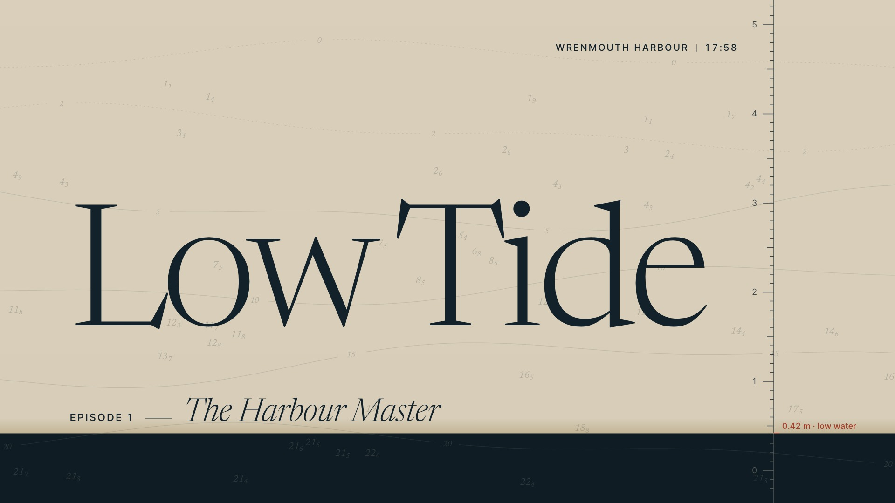
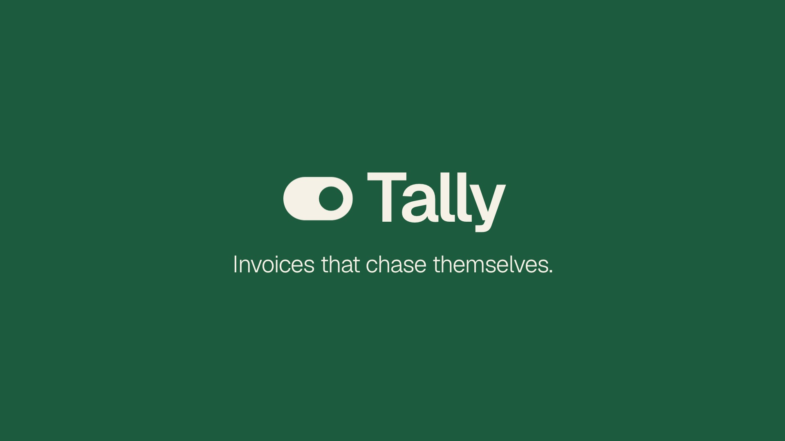
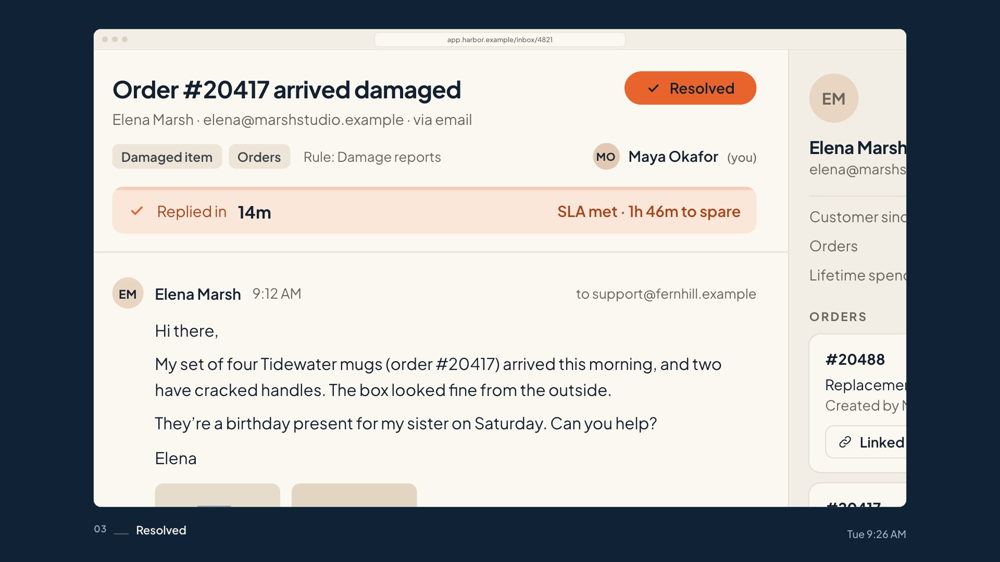
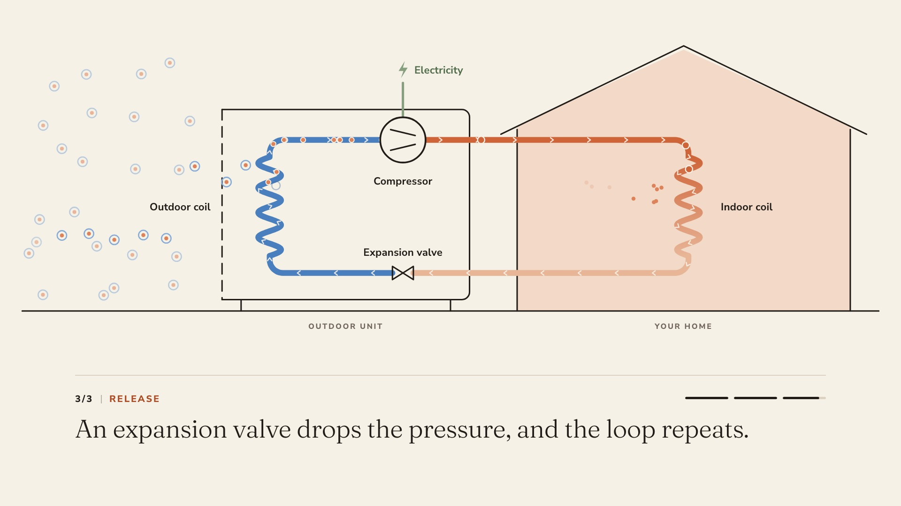
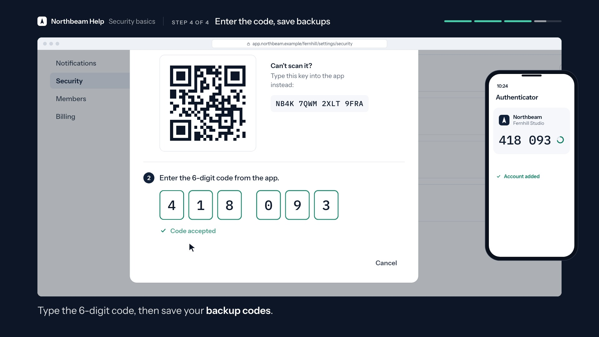
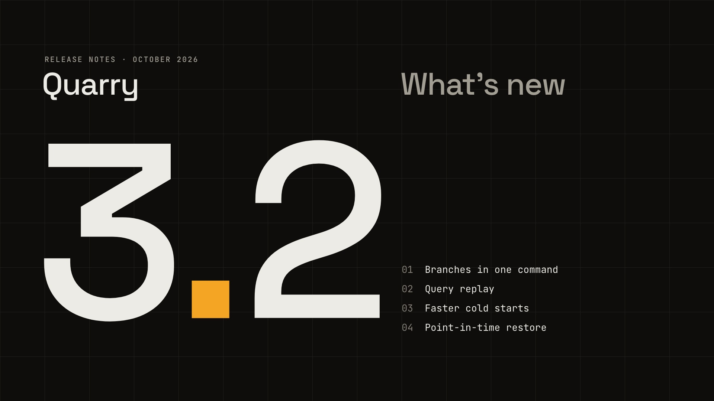
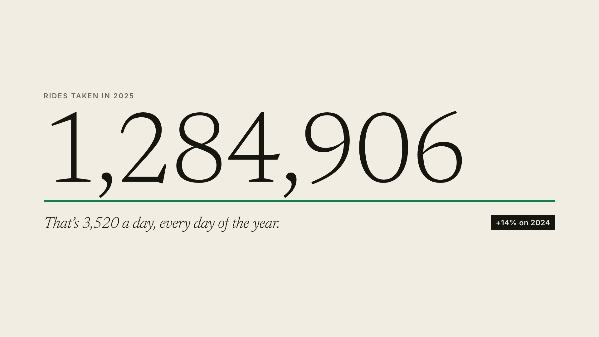
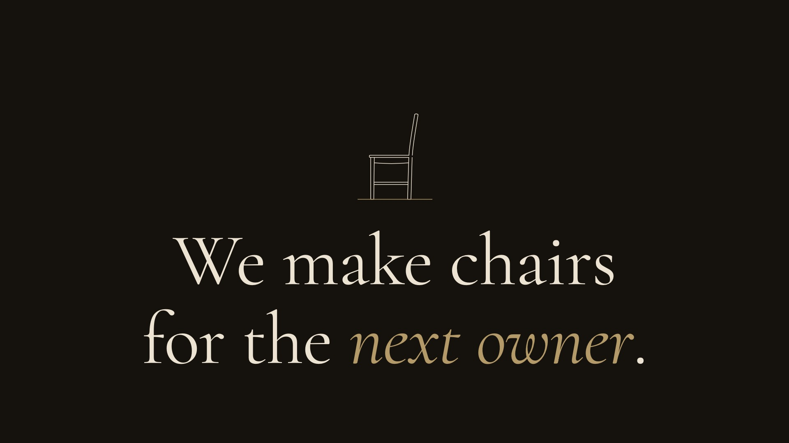
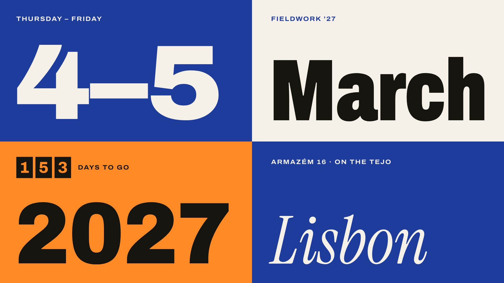
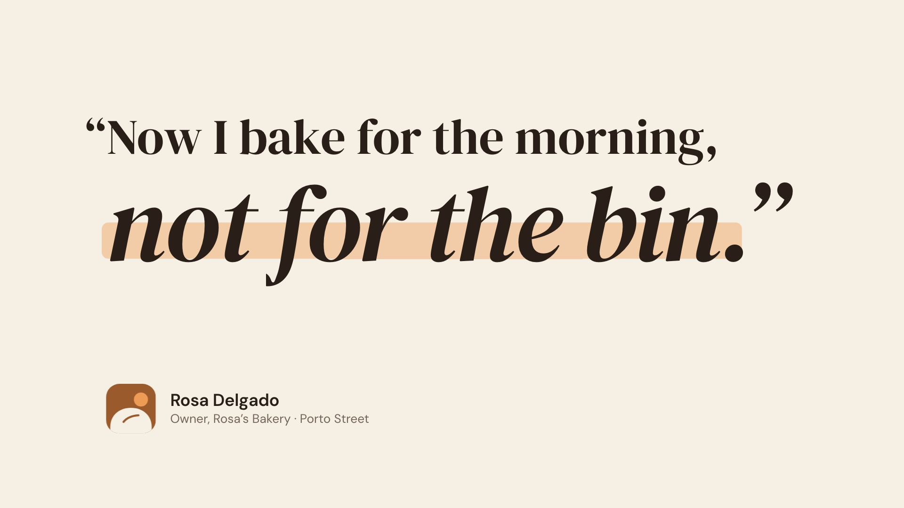

# Claude video skills

Eleven skills that teach Claude to make motion-graphics videos as code. Each video has kinetic typography, animated product UI, charts, transitions and a synthesized music score. Claude checks every film frame by frame, then delivers it as **one HTML file and an MP4**.

Claude works as a senior in-house creative team would: a creative director, motion designer, film editor, typographer and sound designer in one. It writes a brief, a concept, boards and a beat sheet before it builds. Then it runs a director's review against a "studio finish" standard, which is how the films avoid looking AI-generated.

## Examples

Every skill folder has a finished example film in `examples/`: the HTML, the MP4 and a poster. Each was made with that skill, following its own instructions. All the brands, people and numbers in them are fictional.

Click a poster to watch the film.

| | | |
|---|---|---|
| [](motion-film/examples/low-tide-titles.mp4) | [](launch-film/examples/tally-launch.mp4) | [](product-walkthrough/examples/harbor-walkthrough.mp4) |
| **Low Tide** · title sequence | **Tally** · launch film | **Harbor** · product walkthrough |
| [](explainer-video/examples/heat-pump-explainer.mp4) | [](tutorial-video/examples/northbeam-two-step.mp4) | [](feature-update/examples/quarry-3-2-whats-new.mp4) |
| **Heat pump** · explainer | **Northbeam** · tutorial | **Quarry 3.2** · feature update |
| [](data-story/examples/halden-bikes-2025.mp4) | [](brand-film/examples/morrow-manifesto.mp4) | [](event-promo/examples/fieldwork-27-promo.mp4) |
| **Halden Bikes** · data story | **Morrow & Daughters** · brand film | **Fieldwork '27** · event promo |
| [](testimonial-video/examples/crumb-rosas-bakery.mp4) | [](social-ad/examples/fernly-reel.mp4) | |
| **Rosa's Bakery × Crumb** · testimonial | **Fernly** · vertical social ad (9:16) | |

| Skill | Example film | Style | Length |
|---|---|---|---|
| [`motion-film`](motion-film/) | [**Low Tide**, a documentary title sequence](motion-film/examples/low-tide-titles.mp4) | Cinematic, type-led | 26 s |
| [`launch-film`](launch-film/) | [**Tally**: invoices that chase themselves](launch-film/examples/tally-launch.mp4) | Clean, concept-led | 30 s |
| [`product-walkthrough`](product-walkthrough/) | [**Harbor**: a ticket from arrival to resolved](product-walkthrough/examples/harbor-walkthrough.mp4) | Calm product tour | 30 s |
| [`explainer-video`](explainer-video/) | [**How a heat pump heats your home**](explainer-video/examples/heat-pump-explainer.mp4) | Warm diagram explainer | 32 s |
| [`tutorial-video`](tutorial-video/) | [**Turn on two-step sign-in** in Northbeam](tutorial-video/examples/northbeam-two-step.mp4) | Professional how-to | 30 s |
| [`social-ad`](social-ad/) | [**Fernly**: "Your plant isn't dramatic."](social-ad/examples/fernly-reel.mp4) | Bold vertical (9:16) | 15 s |
| [`feature-update`](feature-update/) | [**Quarry 3.2**: what's new](feature-update/examples/quarry-3-2-whats-new.mp4) | Tech release notes | 26 s |
| [`data-story`](data-story/) | [**Halden Bikes**: 2025 in rides](data-story/examples/halden-bikes-2025.mp4) | Editorial year-in-review | 30 s |
| [`brand-film`](brand-film/) | [**Morrow & Daughters**: a manifesto](brand-film/examples/morrow-manifesto.mp4) | Premium, restrained | 26 s |
| [`event-promo`](event-promo/) | [**Fieldwork '27**, Lisbon](event-promo/examples/fieldwork-27-promo.mp4) | Joyful, kinetic | 24 s |
| [`testimonial-video`](testimonial-video/) | [**Rosa's Bakery** × Crumb](testimonial-video/examples/crumb-rosas-bakery.mp4) | Warm customer story | 26 s |

Open any `.html` example in Chrome or Edge and press play (sound on), or watch the `.mp4`.

## The skills

| Skill | Use it for | Starter preset |
|---|---|---|
| [`motion-film`](motion-film/SKILL.md) | Any motion-graphics video: the general-purpose skill (title sequences, promos, kinetic type) | Clean |
| [`launch-film`](launch-film/SKILL.md) | Product, feature and company launches, announcements, teasers | Clean |
| [`product-walkthrough`](product-walkthrough/SKILL.md) | Product tours, demos, onboarding, "how it works" screen tours | Clean |
| [`explainer-video`](explainer-video/SKILL.md) | "How it works" or "what is X" explainers, process and concept videos | Warm |
| [`tutorial-video`](tutorial-video/SKILL.md) | Step-by-step how-tos, help-centre videos, training | Professional |
| [`social-ad`](social-ad/SKILL.md) | Vertical Reels, TikTok and Shorts ads and posts (1080×1920) | Bold |
| [`feature-update`](feature-update/SKILL.md) | What's new, release notes, changelog videos | Tech |
| [`data-story`](data-story/SKILL.md) | Year-in-review, "wrapped", KPI and impact reports, investor updates | Editorial |
| [`brand-film`](brand-film/SKILL.md) | Manifestos, mission and values films, rebrands, logo stings | Premium |
| [`event-promo`](event-promo/SKILL.md) | Conferences, webinars, meetups, launches, countdowns | Fun |
| [`testimonial-video`](testimonial-video/SKILL.md) | Customer quotes, case studies, social proof, logo walls | Warm |

Each skill works for any brand, product or idea. Eight style presets (Clean, Professional, Bold, Fun, Premium, Tech, Warm and Editorial) cover everything from corporate to playful, and your own brand guide overrides them.

### What's in a skill folder

**Every `SKILL.md` is fully self-contained.** Download just the one file and Claude can make a video. Each SKILL.md holds:
- the playbook;
- the complete starter film;
- the whole toolkit, embedded in its appendix.

Claude unpacks the starter film and toolkit with one command, so it never has to retype them.

The rest of the folder is optional:

```text
launch-film/
├── SKILL.md                 everything: role, creative dials, story, presets, design system, studio finish, sound,
│                            verify, export, plus the starter film and toolkit embedded in its appendix
├── templates/starter.html   a complete, working starter film (engine, player, recorder hooks, score)
├── scripts/                 the toolkit Claude runs
│   ├── verify.py            timeline sweep, font check, blank-frame and static-hold scan, contact sheets, MP4 export
│   ├── analyze.py           score analysis: loudness, balance, air, stereo width, timing, clicks → PASS/WARN verdict
│   ├── fonts.py             embeds Google Fonts or brand font files as base64
│   ├── inline.py            inlines every local asset, so the film is one file
│   └── vo_timing.py         syncs a voiceover: finds where each line lands
└── examples/                a finished film: .html, .mp4 and .jpg poster (for viewing; not needed to make videos)
```

`templates/` and `scripts/` hold the same files as the appendix, as plain files for reading and editing. When they are present, Claude copies from them; when only SKILL.md is installed, it unpacks the embedded copies.

**Maintainers:** after editing anything in `templates/` or `scripts/`, run `python sync_embedded.py` from the repo root, so every SKILL.md carries the same files. `python sync_embedded.py --check` reports any drift.

## Install

- **Claude Code:**
  - Put the skill in `~/.claude/skills/<name>/` (for all projects), or in `.claude/skills/<name>/` inside a project. For example: `~/.claude/skills/launch-film/SKILL.md`.
  - Copy just `SKILL.md` into that folder, or the whole skill folder.
  - Claude picks the skill up when your request matches it, or you can invoke it by name (`/launch-film`).
- **Claude apps (claude.ai):**
  1. Zip the skill folder (or a folder that contains just its `SKILL.md`), so the zip contains `launch-film/SKILL.md`.
  2. Upload the zip under **Settings → Capabilities → Skills** (code execution must be enabled).
- **Claude Agent SDK and API:** place the folder in your agent's skills directory.

Then ask for a video in plain words:

> "Make a 30-second launch video for our new invoicing app. Here's the site: … Use our brand colours."

Claude gathers the facts, researches references, writes the concept and beat sheet, builds the film, and verifies it frame by frame.

If you haven't said which format you want, Claude asks: **an HTML file, an MP4, or both**.
- **HTML:** plays offline in Chrome or Edge, with a player, and stays editable.
- **MP4:** a normal video file for social, YouTube, email and slides.
- With no answer, you get both.

## Creative controls

Every skill has four dials you can set in your request. **Any dial you don't set is `medium`**, the professional default.

| Option | Values | What it controls |
|---|---|---|
| `--creativity:` | `low` · `medium` · `high` | Concept and art direction: from literal and clear, to one strong visual motif, to a concept-led film with metaphor, match cuts and unexpected framing |
| `--typography:` | `low` · `medium` · `high` | From simple set type, to a full type system (pairing, scale, accents), to type as the hero (extreme scale contrast, per-letter and kinetic treatments) |
| `--animation:` | `low` · `medium` · `high` | How things move: from calm fades with long holds, to the style's motion language, to the full principles of animation (anticipation, follow-through, arcs, camera choreography) |
| `--motion:` | `low` · `medium` · `high` | Motion-graphics devices: from cuts and flat backgrounds, to strokes, wipes and masks, to a full motion system (morphs, parallax, particles, 2.5D, kinetic logo builds) |
| `--all:` | `low` · `medium` · `high` | Sets all four at once; a specific dial overrides it |

**Rules:**
- Write the options anywhere in your message, for example `--creativity:high`, `--creativity=high` or `--creativity high`.
- `--motion-graphics:` works like `--motion:`. `normal` means `medium`, `min` means `low`, and `max` means `high`.
- Claude confirms the settings it used at the start and in the hand-off, and records them in the film file, so later edits keep them.
- The dials change how much craft is applied, never your facts, brand or message. Your brand guidelines and accessibility rules always win.

**Examples:**

```text
Make a 30-second launch video for our invoicing app --creativity:high --typography:high
Turn this year's numbers into a data story --all:low --typography:high
Event promo for our meetup on 12 Nov --motion:high --animation:high
Customer testimonial from this quote --creativity:low
```

## Voiceover (optional)

Most films are type-led and need no voice. When narration helps (explainers, tutorials, walkthroughs), no API or key is needed:

1. Ask for a voiceover. Claude writes the script, one line per caption with `<break time="0.6s" />` pauses. It's ready to paste into [ElevenLabs](https://elevenlabs.io) (or any TTS), with suggested voice settings.
2. Generate the audio there and paste the MP3 into the chat, or give its path.
3. Claude runs `vo_timing.py` to find where each line lands. It pins the picture to the words, ducks the score under the voice, and exports the MP4 with the voice mixed in.

## Requirements

- **To watch a film:** Chrome or Edge. Open the HTML file and press play.
- **To verify and export** (Claude runs these for you):
  - Python 3 with `pip install websocket-client pillow numpy` (plus `miniaudio` to read MP3 voiceovers without FFmpeg).
  - Chrome, Chromium or Edge.
  - FFmpeg, for the MP4.

## What every film includes

- **One HTML file** that plays offline: fonts, images and voiceover are inlined, and the music is generated in the page.
- **An MP4 and a poster**, from one command (`python verify.py film.html mp4`). Every frame is rendered deterministically and the score offline, normalised to −14 LUFS, H.264 with `+faststart`. Add `--scale 2` for 4K, or `60` for 60 fps.
- **A fixed 1920×1080 (or 1080×1920) stage** that scales to any window, with play and pause, seeking, mute, fullscreen and a poster frame.
- **A verification pass before hand-off:**
  - A timeline sweep for errors, and a check that every font is embedded.
  - Automatic detection of blank frames and dead holds.
  - Contact sheets reviewed visually, and an audio analysis with a PASS/WARN verdict.
  - A scored director's review.

---
*Created by Neel Shah*
